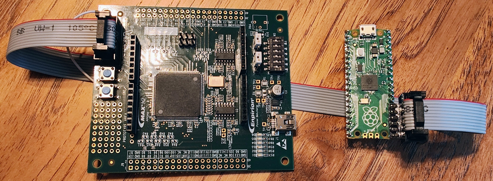
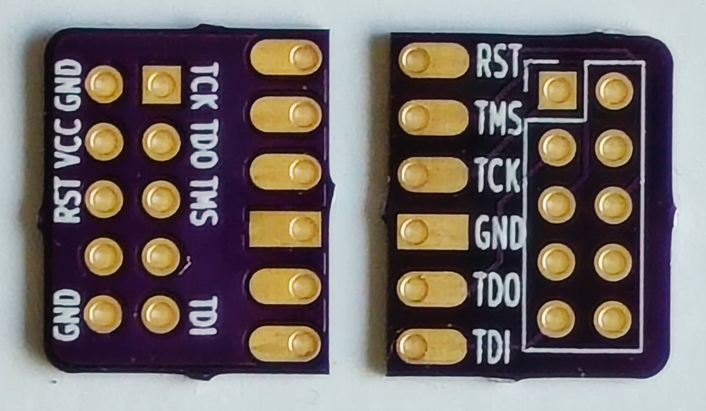
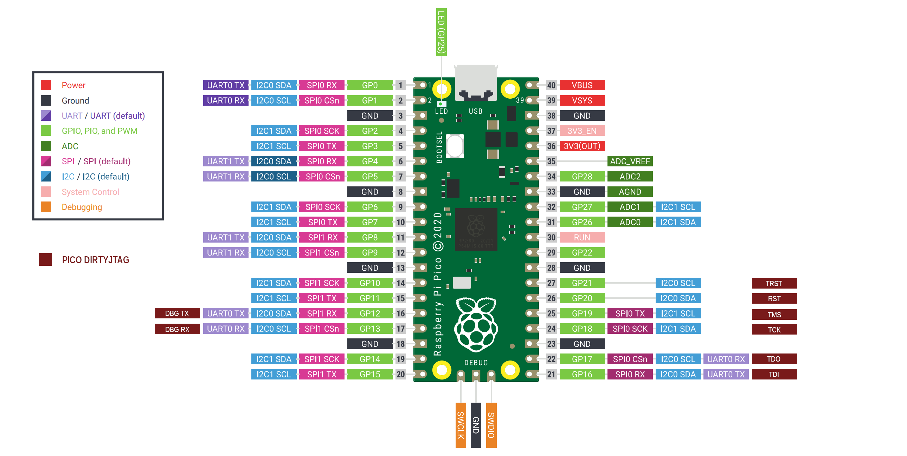
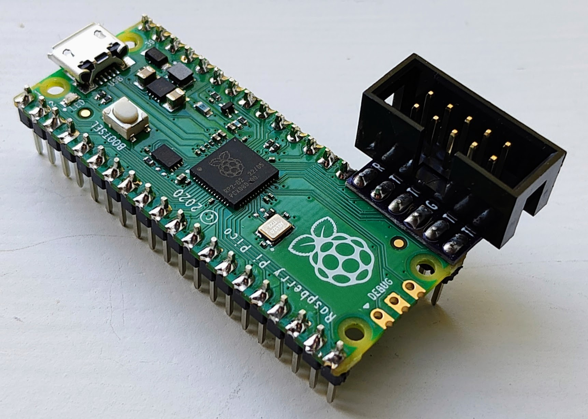
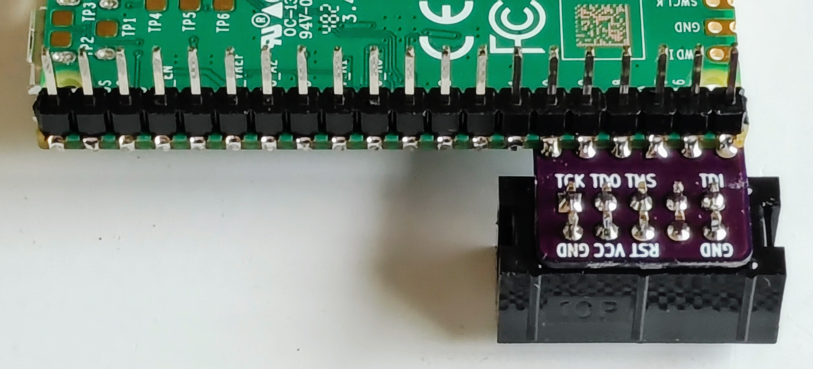

# Pico-Dirty-Blaster Workshop
Files and documentation for Pico-Dirty-Blaster Workshop


## Instructions

 1. Assemble Pico-Dirty-Blaster
    1. Solder adapter PCB to Raspberry Pi Pico board
    2. Solder 10pin shrouded header connector to adapter board
 2. Connect Pico-Dirty-Blaster to target board with ribbon cable
 3. Plug in power to target board
 4. While pressing BOOTSEL button, plug in Raspberry Pi Pico board
 5. Release the BOOTSEL button after connecting the USB cable
 6. Drag-n-Drop chosen example pico UF2 file to the "RPI-RP2" drive that appears
 7. Wait for the file to transfer and Pico board will disconnect and begin programming
 8. If programming is successful, the RPI-RP2 drive will reapear and the image will load

## Example Files
Example images are provided by target board in the "examples" folder.  Current example images are built from FuseSoC blinky with different output LED settings, and a SERV Servant RISC-V hello world example, also built with FuseSoC.

## Detailed Instructions

### Assembling Pico-Dirty-Blaster
An adapter PCB is provided that connects to pins 21 - 26 of the Raspberry Pi Pico board.  

These are the JTAG pins used by the Pico DirtyJTAG project as shown here:

These boards should be soldered together with a single row header installed in the bottom of the Pico board with the adapter PCB on the top side as shown in these pictures:


It is recommended to solder pins 40 and 28 of the header to hold it in place first, then start soldering the adapter to the short header pins extending through the top side of the Pico board.  The adapter should line up with the end of the Pico board.  The silkscreen outline of the 10 pin header should face up, away from the Pico board.  The rectangluar GND pad on the adapter should match up with the rectangluar GND pad on the Pico board.
After the six pins are soldered to the adapter, you can finish soldering the rest of the header and the other 20 pin header to the other edge of the Pico board.
Next solder the pads on the back side of the adapter PCB to the castlelated edge pads of the Pico board.
Finally, solder the 10 pin shrouded header to the adapter PCB.  The shrouded header should cover up the silkscreen outline on the top side of the board.  Ensure that the cutout in the side of the shroud and the pin 1 indicator line up with the square pin one pad of the adapter.

### Connect the Pico-Dirty-Blaster to the target board
Use the 10pin ribbon cable to connect the Pico-Dirty-Blaster to the target board.  The shrouded headers are keyed so it should only fit one way.

### Plug in power to target board
Use the mini USB cable provided with the target board to provide power

### While pressing BOOTSEL button, plug in Raspberry Pi Pico board
Hold down the BOOTSEL button while connecting the Pico adapter to the computer with a micro USB cable.

### Release the BOOTSEL button after the USB cable is connected
A drive named "RPI-RP2" will appear after the button is released

### Drag-n-Drop example pico UF2 file to the "RPI-RP2" drive
Choose one of the example files and drag-n-drop the UF2 file to the "RPI-RP2" drive.

### Wait for the file to transfer and begin programming
After the file transfer completes, the drive will disconnect and start programming the target.

### The RPI-RP2 drive will reapear and the image will load when programming is complete
If programming is successful, the Pico board will jump back to the bootloader and the "RPI-RP2" drive will reappear.  The image will load and run on the target.
If programming is not successful, the firmware will not jump to the bootloader.  It is recommended to connect a serial console to view the messages for help debuging the issues.

## Extra Credit

### Test the Servant Hello World Example

Follow the instructions for loading an example image above to load "pico-servant-hello.uf2"
Next follow these additional steps:
 1. Load dirtyJtag.uf2 from the firmware directory onto the Pico board.
 2. Connect 10M08 TX (J5 pin 7) to Pico RX (pin 17)
 3. Connect serial terminal to Pico DirtyJTAG (8n1, 57600 baud)
 4. Press SW1 to reset the 10M08 and watch for the message

 ### Load SVF image using openFPGALoader

 1. Install openFPGALoader using [instructions in openFPGALoader documentation](https://trabucayre.github.io/openFPGALoader/guide/install.html). 
 2. Connect Pico-Dirty-Blaster to target with ribbon cable.
 3. Load dirtyJtag.uf2 from the firmware directory onto the Pico board.
 4. Load SVF file with this command ```openFPGALoader -b boardname <example>.svf```
 5. Wait, and wait some more, this will take minutes, but it works.


