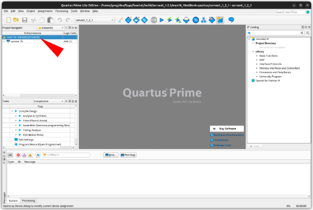
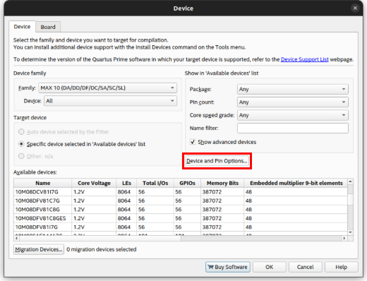
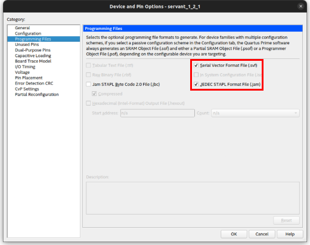

# How to generate JBC files

Instructions for generating compatible JBC files

## Right click on the device part number in Quartus

## Click on "Device and Pin Options..." button

## Check SVF and JAM boxes
**Do NOT select the JBC box.**  
The JBC option in this menu can only generate compressed JBC files.  We will be storing the JBC file in flash and running it in place since there is not enough RAM to hold the decompressed image.  

## Convert to uncompressed JBC
Convert the JAM file to uncompressed JBC with this command after building:
`quartus_jbcc.exe -n <filename>.jam <filename>.jbc`
The "-n" option is for uncompressed JBC.

With MAX10 devices, always use the `_pof.jam` and `_pof.svf` files as these target the internal flash.  The files without `_pof` target SRAM and the image will be lost when power is removed.
