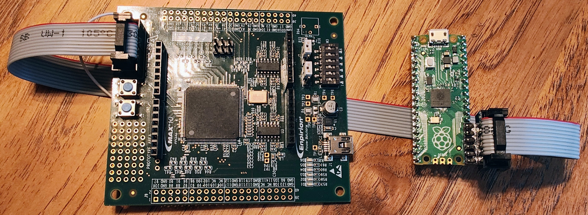

# Pico-Dirty-Blaster Workshop
# Module 2:  Drag-n-Drop JBC UF2 Files
Files and documentation for Pico-Dirty-Blaster Workshop

## Detailed Instructions

### Connect the Pico-Dirty-Blaster to the target board
Use the 10pin ribbon cable to connect the Pico-Dirty-Blaster to the target board.  The shrouded headers are keyed so it should only fit one way.

### Plug in power to target board
Use the mini USB cable provided with the target board to provide power

### While pressing BOOTSEL button, plug in Raspberry Pi Pico board
Hold down the BOOTSEL button while connecting the Pico adapter to the computer with a micro USB cable.

### Release the BOOTSEL button after the USB cable is connected
A drive named "RPI-RP2" will appear after the button is released

### Drag-n-Drop example pico UF2 file to the "RPI-RP2" drive
Choose one of the example "pico-blinky" uf2 files and drag-n-drop the UF2 file to the "RPI-RP2" drive.

### Wait for the file to transfer and begin programming
After the file transfer completes, the drive will disconnect and start programming the target.

### The RPI-RP2 drive will reapear and the image will load when programming is complete
If programming is successful, the Pico board will jump back to the bootloader and the "RPI-RP2" drive will reappear.  The image will load and run on the target.
If programming is not successful, the firmware will not jump to the bootloader.  It is recommended to connect a serial console to view the messages for help debuging the issues.

## Extra Credit:  Test the Servant Hello World Example

### Load "pico-servant-hello.uf2"
Follow the instructions for loading an example image above to load "pico-servant-hello.uf2"

### Load pico-dirtyJTag firmware
Drag-n-drop "firmware/dirtyJtag.uf2" onto the Raspberry Pi Pico board to load dirtyJtag firmware.

### Connect UART signal
With the JTAG cable still connected between the pico and MAX10 EVK, connect a wire between 10M08 TX (J5 pin 7) and Pico RX (pin 17/GP13)

### Connect Serial Terminal
Connect a serial terminal to the virtual UART implemented in the pico-dirtyJtag firmware.  (8n1, 57600 baud)

### Observe the message on the UART 
With the terminal connected, press SW1 to reset the MAX10 and watch for the message

 
