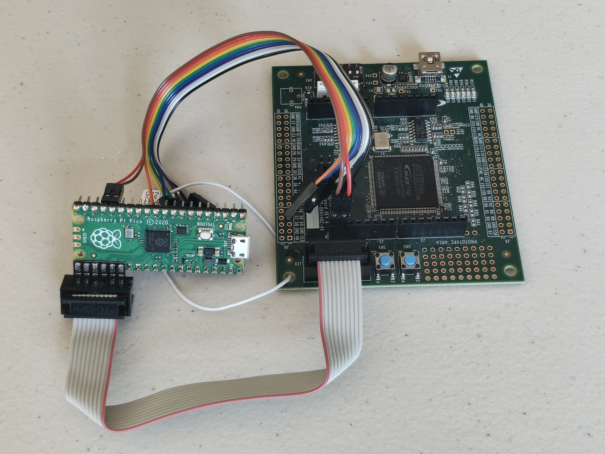

# Pico-Dirty-Blaster Workshop
# Module 3:  Programming with openFPGALoader
Files and documentation for Pico-Dirty-Blaster Workshop


This module will demonstrate how to load an FPGA image using openFPGALoader with the Pico-DirtyJtag adapter, and then how to use it to write data to user flash memory (UFM) in the MAX10 FPGA.

## Overview

1. Install openFPGALoader
2. Load dirtyJtag firmware image into pico adapter
3. Connect pico adapter to MAX10 EVK
4. Open and connect serial terminal
5. Load MAX10 FPGA image using openFPGALoader
6. Update firmware in UFM using openFPGALoader

### Extra Credit

Build and load new firmware for PicoRV32

## Detailed Instructions

### Install openFPGALoader

Install openFPGALoader using [instructions in openFPGALoader documentation](https://trabucayre.github.io/openFPGALoader/guide/install.html). 
 
### Load dirtyJtag firmware image into pico adapter

Hold the BOOTSEL button while plugging in the Raspberry Pi Pico board to activate the UF2 bootloader.  When the drive named "RPI-RP2" appears, drag-n-drop the "firmware/dirtyJtag.uf2" file onto the drive.  Then disconnect the board from the computer.

### Connect pico adapter to MAX10 EVK

Connect the 10 pin ribbon cable from the Pico Dirty Blaster to the JTAG Header on the MAX10 EVK (J10).  Connect the UART signals with the leads provided:  10M08 TX (J5 pin 7) to Pico RX (pin 17/GP13) and 10M08 RX (J5 pin 8) to Pico TX (pin 16/GP12).


### Open and connect serial terminal

Using your favorite serial terminal.  Open and connect (8n1, 115200 baud).  Here is the command for Python miniterm:
```
python3 -m serial.tools.miniterm /dev/ttyACM0 115200
```
Replace "/dev/ttyACM0" with the first tty that appears after plugging in the adapter.

### Load MAX10 FPGA image using openFPGALoader

Load the provided MAX10 example image into the MAX10 EVK using openFPGALoader:
```
openFPGALoader -c dirtyJtag picomax10m08evk.pof
```
Observe the LEDs and the serial terminal for activity.

### Update firmware in UFM using openFPGALoader

Load modified firmware into UFM using openFPGALoader:
```
openFPGALoader -c dirtyJtag picomax_fw_update.bin
```
Observe the LEDs and the serial terminal for activity, then load another different image:
```
openFPGALoader -c dirtyJtag --flash-sector UFM1 picomax_fw_alternate.bin
```

## Extra Credit Instructions

Build your own PicoRV32 image and load it into the board.

### Install RISC-V Toolchain

You will need a RISC-V toolchain to build the firmware.  If you do not have one already installed, the [PicoRV32 project has scripts and instructions for installing](https://github.com/YosysHQ/picorv32?tab=readme-ov-file#building-a-pure-rv32i-toolchain).

### Clone picomaxdev project and build firmware

Clone the [picomaxdev project](https://github.com/gsteiert/picomaxdev), then, from the firmware directory build the firmware with this command:
```
make max10m08evk_fw.bin
```
Check that the image builds successfuly to confirm the tools and project are installed corrrectly.

### Modify code and build again

Change the splash screen or LED paterns in the code and build again.  
```
make max10m08evk_fw.bin
```

### Load your new firmware into UFM with PicoRV32

Use openFPGALoader as before to load the firmware you modified, and observe the behavior.
```
openFPGALoader -c dirtyJtag --flash-sector UFM0 max10m08evk_fw.bin
```

